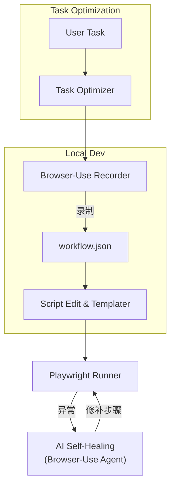
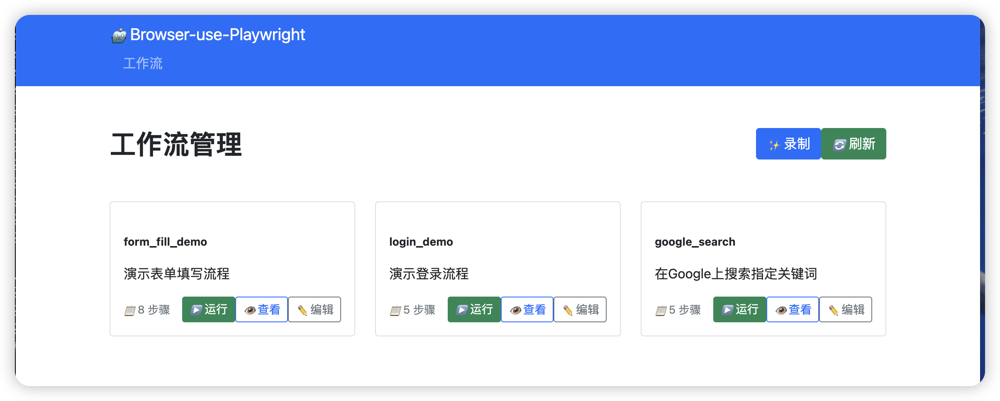
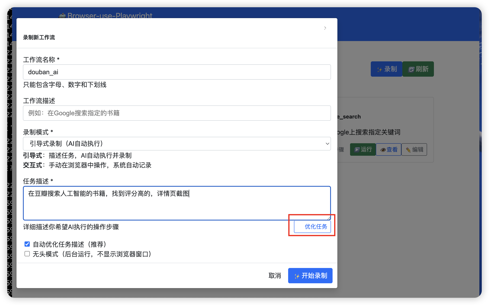
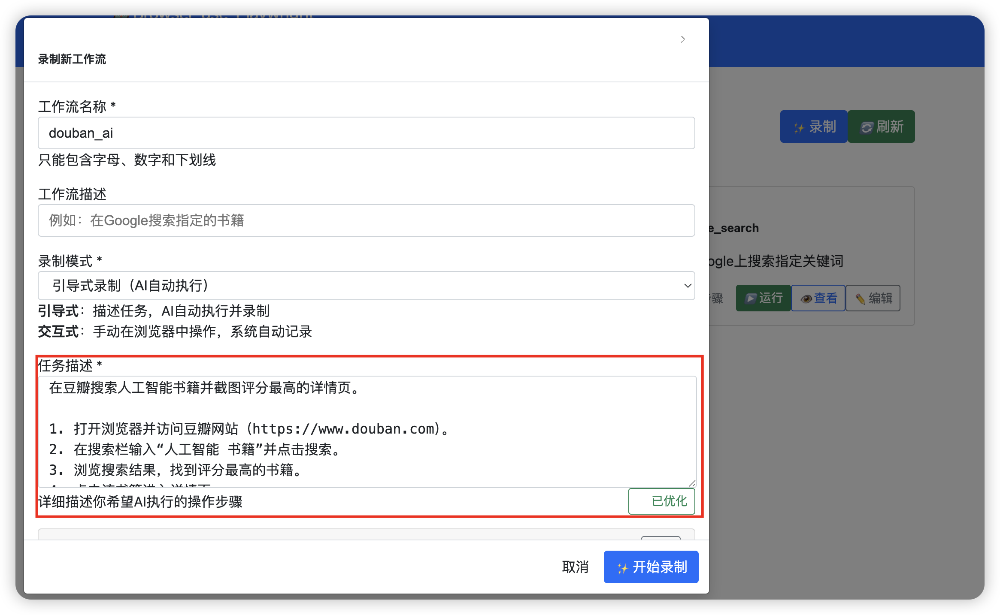
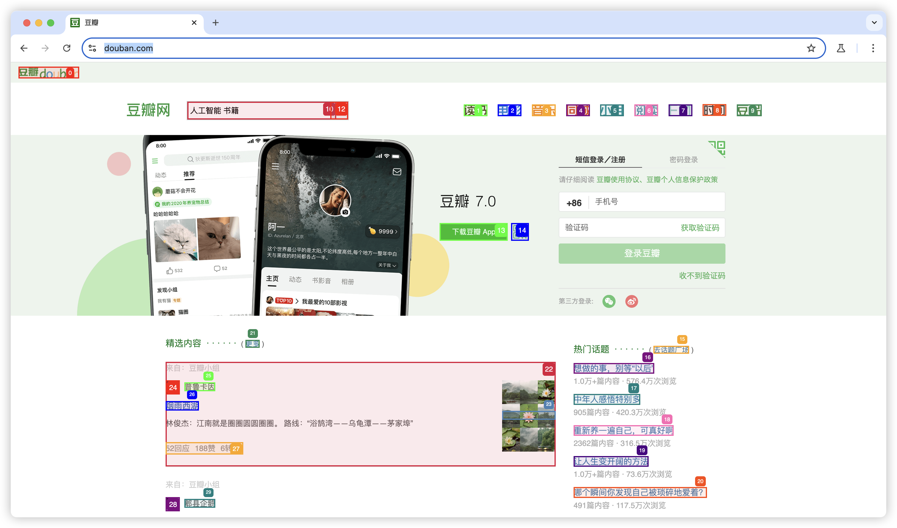
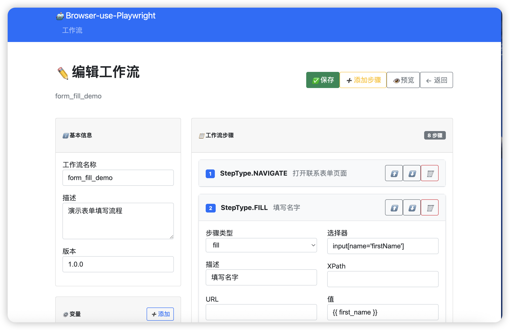

# Browser-Use-Playwright

> **一站式自动化方案：Browser-Use 低代码录制 → Playwright 稳定执行 → Browser-Use 智能自愈。**

[](https://www.python.org/downloads/)
[](LICENSE)
[](https://github.com/psf/black)

---

## ⚠️ 实验性项目声明

**本项目是 [WW-AI-Lab](https://github.com/WW-AI-Lab) 的实验性原型项目。**

- 🧪 **实验目的**: 探索 Browser-Use + Playwright 结合的可行性和最佳实践
- 🚀 **快速迭代**: 优先验证核心功能，不保证生产环境稳定性
- 📚 **学习分享**: 完整记录开发过程、踩坑经验和解决方案
- 🔄 **持续演进**: 成熟后将迁移到 [YFGaia](https://github.com/YFGaia) 作为生产级方案

**使用建议**: 适合学习研究、概念验证，生产使用请谨慎评估或联系我们获得专业支持。

---

## 📑 项目简介
本仓库给出了「**录制-执行-自愈**」三阶段的参考实现，实现了真正的"录制一次，重复执行，智能修复"的RPA自动化解决方案：

| 阶段 | 主要组件                                                     | 职责                                                         |
| ---- | ------------------------------------------------------------ | ------------------------------------------------------------ |
| 录制 | **[Browser-Use](https://github.com/browser-use/browser-use)** | 可视化录屏，生成 `*.workflow.json`，支持变量与占位符。 |
| 执行 | **[Playwright](https://playwright.dev/)**                    | 高并发、可复用本地 Chrome Profile；运行前对占位符做 Jinja2 渲染。 |
| 自愈 | **Browser-Use** (与录制阶段一致) | 失败时回退到Browser-Use处理具体环节，生成修复步骤并替换原有逻辑，实现工作流的自我进化。 |

### 🌟 核心特性
- **🎯 零代码录制**: 通过Browser-Use直观录制复杂Web操作流程
- **⚡ 高性能执行**: 基于Playwright的并发执行引擎，支持10+并发任务
- **🧠 智能自愈**: Browser-Use驱动的错误修复，自动适应页面变化
- **🔧 模板化支持**: Jinja2模板系统，支持动态变量和上下文渲染
- **📊 企业级可靠性**: 内置监控、日志和性能分析功能
- **🎨 任务优化器**: 内置智能提示词优化，提升Browser-Use执行效果

---

## 🏗️ 架构概览


- **灵活录制**：支持本地 Chrome (`executablePath` + `userDataDir`) 复用 Cookie & 插件。
- **脚本编辑**：自动去重点击、替换 `sleep` 为智能等待，抽象选择器/文本为占位符等编辑。
- **AI 自愈**：捕获失败截图 + DOM → 交给 LLM 在沙箱浏览器里重试，成功后写回脚本。
- **任务优化**：使用专门的提示词优化器，将复杂任务转换为Browser-Use最佳执行格式。

---

## 🚀 快速开始

### 📋 系统要求
- **Python**: 3.11+ (推荐 3.11 或 3.12)
- **操作系统**: macOS, Linux, Windows
- **浏览器**: Chrome/Chromium (推荐)
- **内存**: 最少 4GB RAM，推荐 8GB+

### 1. 一键启动 (推荐)
```bash
# 克隆项目
git clone https://github.com/WW-AI-Lab/browser-use-playwright.git
cd browser-use-playwright

# 🚀 一键创建虚拟环境和安装依赖 (首次运行)
./browser-use-playwright create-venv

# 🌐 启动Web UI界面 (推荐新手使用)
./browser-use-playwright web
# 或直接运行 (默认启动Web UI)
./browser-use-playwright

# 💻 启动CLI模式 (适合高级用户)
./browser-use-playwright cli
```

### 2. 手动环境设置 (可选)
```bash
# 如果喜欢手动控制，也可以传统方式安装
# 创建虚拟环境
python -m venv .venv
source .venv/bin/activate  # macOS/Linux
# 或 .venv\Scripts\activate  # Windows

# 安装依赖
pip install -r requirements.txt

# 安装浏览器
playwright install chromium --with-deps
```

### 3. 配置API密钥
```bash
# 复制环境变量文件
cp env.example .env

# 编辑 .env 文件，添加你的API密钥 (用于Browser-Use)
OPENAI_API_KEY=your_openai_api_key
# 或使用其他支持的LLM提供商
ANTHROPIC_API_KEY=your_claude_api_key
DEEPSEEK_API_KEY=your_deepseek_api_key
```

### 4. 录制第一个工作流
```bash
# 使用CLI工具录制
browser-use-playwright record --name "my_first_workflow" --output ./workflows/

# 或使用Python API
python -c "
from src.core.recorder import WorkflowRecorder
import asyncio

async def main():
    recorder = WorkflowRecorder()
    await recorder.record_workflow(name='my_first_workflow')

asyncio.run(main())
"
```

### 5. 执行工作流
```bash
# 简单执行
browser-use-playwright run --workflow ./workflows/my_first_workflow.json

# 带变量执行
browser-use-playwright run --workflow ./workflows/login.json --context ./contexts/examples/dev.yml

# 自愈模式执行
browser-use-playwright run --workflow ./workflows/login.json --auto-heal
```

### 6. Python API 使用示例
```python
import asyncio
from src.core.recorder import WorkflowRecorder
from src.core.executor import PlaywrightExecutor  
from src.core.healer import BrowserUseHealer

async def main():
    # 录制工作流
    recorder = WorkflowRecorder()
    workflow = await recorder.record_workflow(
        name="login_workflow",
        save_path="./workflows/"
    )
    
    # 执行工作流
    executor = PlaywrightExecutor()
    result = await executor.execute_workflow(
        workflow_path="./workflows/login.json",
        context={"username": "test@example.com", "password": "secret123"},
        concurrent=True
    )
    
    # 如果执行失败，启用Browser-Use自愈
    if not result.success:
        healer = BrowserUseHealer()
        fixed_workflow = await healer.heal_workflow(
            workflow_path="./workflows/login.json",
            failed_step=result.failed_step,
            context=result.context,
            error=result.error
        )
        print(f"工作流已修复: {fixed_workflow}")

if __name__ == "__main__":
    asyncio.run(main())
```

---

## 🎯 Browser-Use 任务优化器

### 什么是任务优化器？

本项目包含一个专门的 **Browser-Use 任务优化器** (`task_optimizer_prompt.txt`)，它能将复杂、模糊的用户需求转换为Browser-Use最佳执行格式。

### 使用方法

1. **直接使用优化器**：
```bash
# 将复杂任务描述通过优化器处理
echo "帮我搜索豆瓣上关于人工智能的书籍，并保存前10个结果" | browser-use-playwright optimize-task
```

2. **在录制时使用**：
```bash
# 录制时自动应用任务优化
browser-use-playwright record --name "search_books" --optimize-task "搜索豆瓣AI书籍并保存结果"
```

3. **手动编辑优化**：
   - 打开 `task_optimizer_prompt.txt` 文件
   - 将用户原始需求放在 `<<USER_TASK>>` 位置
   - 通过LLM处理获得优化后的任务描述

### 优化原则

根据 `task_optimizer_prompt.txt` 中定义的优化规则：

1. **目标聚焦**: 用一句简洁祈使句概括最终目标
2. **步骤明确**: 使用编号列出关键操作，逻辑清晰、可执行
3. **输出精确**: 明确文件名、格式、字段要求
4. **约束清楚**: 列出域名限制、过滤条件、时间约束
5. **验证明确**: 说明完成标志和错误处理方案
6. **表达精确**: 避免模糊指代，使用具体值
7. **单一原则**: 一次一个主目标，复杂任务需拆分说明

### 自定义优化器

您可以根据具体业务需求修改 `task_optimizer_prompt.txt`：

```bash
# 备份原始版本
cp task_optimizer_prompt.txt task_optimizer_prompt.txt.backup

# 编辑优化器
vim task_optimizer_prompt.txt

# 针对特定领域（如电商、金融等）调整优化规则
```

**修改建议**：
- 保持核心优化规则不变
- 根据目标网站特性调整选择器策略
- 添加行业特定的验证规则
- 优化错误处理和重试逻辑

---

## 📂 项目结构
```
browser-use-playwright/
├── 📄 README.md                # 项目说明文档
├── 📄 LICENSE                  # MIT许可证
├── 🚀 browser-use-playwright   # 主启动脚本
├── ⚙️ pyproject.toml           # 项目配置
├── ⚙️ config.yml               # 应用配置
├── 📝 env.example              # 环境变量模板
├── 📦 requirements.txt         # 项目依赖
├── 🎯 task_optimizer_prompt.txt # Browser-Use任务优化器
│
├── 📁 src/                     # 💻 源代码目录
│   ├── core/                   # 核心功能模块
│   ├── utils/                  # 工具函数集
│   ├── models/                 # 数据模型定义
│   ├── cli/                    # 命令行接口
│   └── web/                    # Web界面
│
├── 📁 workflows/               # 🎬 工作流存储
│   ├── examples/               # 示例工作流
│   └── user/                   # 用户工作流(gitignore)
│
├── 📁 contexts/                # 🔧 配置上下文
│   └── examples/               # 示例配置文件
│       ├── dev.yml            # 开发环境配置
│       ├── production.yml     # 生产环境配置
│       └── testing.yml        # 测试环境配置
│
├── 📁 docs/                    # 📖 开发文档
│   ├── development-plan.md     # 开发规划文档
│   ├── github-opensource-preparation-plan.md  # 开源准备计划
│   └── ...                    # 其他技术文档
│
├── 📁 .cursor/                 # 🎨 Cursor IDE 配置
│   └── rules/                  # Cursor Rules 文件
│       ├── README.mdc          # Rules 使用说明
│       ├── project-overview.mdc # 项目概览规则
│       ├── coding-standards.mdc # 编码规范
│       ├── architecture-patterns.mdc # 架构模式
│       ├── browser-automation.mdc # 浏览器自动化规则
│       ├── web-ui-development.mdc # Web UI 开发规则
│       └── development-workflow.mdc # 开发流程规则
│
├── 📁 scripts/                 # 🔧 辅助脚本
├── 📁 tests/                   # 🧪 测试文件
├── 📁 chrome-profiles/         # 🌐 浏览器配置文件
└── 📁 logs/                    # 📋 日志目录
```

---

## 📖 开发文档

### docs/ 目录说明

`docs/` 目录包含完整的开发文档，记录了从想法到原型的整个过程：

- **`development-plan.md`** - 详细的开发规划和里程碑
- **`github-opensource-preparation-plan.md`** - 开源准备工作记录
- **`PHASE_2_EXECUTION_GUIDE.md`** - 执行阶段开发指南
- **`browser-use-test-guide.md`** - Browser-Use 测试指南
- **其他技术文档** - 各模块的详细设计和实现说明

### .cursor/rules/ 目录说明

为了在 [Cursor IDE](https://cursor.sh/) 中获得最佳开发体验，我们提供了完整的 Rules 配置：

#### 🎯 核心 Rules 文件

- **`project-overview.mdc`** - 项目整体架构和目标
- **`coding-standards.mdc`** - Python 编码规范和最佳实践
- **`architecture-patterns.mdc`** - 架构模式和设计原则
- **`browser-automation.mdc`** - Browser-Use 和 Playwright 开发规范
- **`web-ui-development.mdc`** - FastAPI + Web UI 开发指南
- **`development-workflow.mdc`** - 开发流程和工具使用

#### 🚀 如何使用 Cursor Rules

1. **直接使用**：克隆项目后，Cursor IDE 会自动识别 `.cursor/rules/` 目录
2. **快速上手**：查看 `.cursor/rules/README.mdc` 了解规则结构
3. **自定义规则**：根据团队需求修改或扩展规则文件
4. **最佳实践**：遵循规则文件中的编码风格和架构指导

#### 💡 Rules 的价值

- **🎯 上下文一致性** - 确保 AI 助手理解项目架构和目标
- **📏 编码规范** - 统一的代码风格和最佳实践
- **🚀 开发效率** - 减少重复解释，提升 AI 代码生成质量
- **📚 知识传承** - 新团队成员快速理解项目规范

---

## 🛠️ 启动方式和CLI命令参考

### 🚀 主启动脚本 `./browser-use-playwright`

这是项目的主入口脚本，支持多种启动方式：

```bash
# 默认启动Web UI
./browser-use-playwright

# 显式启动Web UI
./browser-use-playwright web

# 启动CLI交互模式
./browser-use-playwright cli

# 创建虚拟环境
./browser-use-playwright create-venv

# 直接执行CLI命令
./browser-use-playwright record --name "test_workflow"
./browser-use-playwright run ./workflows/test.json
./browser-use-playwright list
```

### 💻 CLI命令详解

#### 📹 录制命令 `record`
```bash
# 基础录制
browser-use-playwright record --name "workflow_name"

# 指定输出目录
browser-use-playwright record --name "login_flow" --output ./workflows/user/

# 带描述的录制
browser-use-playwright record --name "search_books" --description "搜索豆瓣图书"

# 使用任务优化器
browser-use-playwright record --name "optimized_task" --optimize-task "复杂任务描述"
```

#### ▶️ 执行命令 `run`
```bash
# 基础执行
browser-use-playwright run ./workflows/login.json

# 带上下文变量执行
browser-use-playwright run ./workflows/search.json --context ./contexts/examples/dev.yml

# 启用自愈模式
browser-use-playwright run ./workflows/complex.json --auto-heal

# 并发执行
browser-use-playwright run ./workflows/batch.json --concurrent --workers 5
```

#### 📋 管理命令
```bash
# 列出所有工作流
browser-use-playwright list

# 显示工作流详情
browser-use-playwright show workflow_name

# 清理工作流
browser-use-playwright clean --backup

# 自愈工作流
browser-use-playwright heal ./workflows/broken.json

# 优化任务描述
browser-use-playwright optimize-task "原始任务描述"
```

---

## 🔧 配置说明

### 环境变量配置

项目支持多种LLM提供商，通过环境变量进行配置：

```bash
# OpenAI (推荐)
export OPENAI_API_KEY="your_api_key"
export OPENAI_MODEL="gpt-4o"

# Anthropic Claude
export ANTHROPIC_API_KEY="your_api_key"
export ANTHROPIC_MODEL="claude-3-sonnet-20240229"

# DeepSeek
export DEEPSEEK_API_KEY="your_api_key"
export DEEPSEEK_BASE_URL="https://api.deepseek.com/v1"
export DEEPSEEK_MODEL="deepseek-chat"

# Azure OpenAI
export AZURE_OPENAI_API_KEY="your_api_key"
export AZURE_OPENAI_ENDPOINT="https://your-resource.openai.azure.com/"
export AZURE_OPENAI_DEPLOYMENT="your-deployment-name"
```

### 配置文件

主配置文件 `config.yml` 包含所有默认设置：

```yaml
app:
  name: "browser-use-playwright"
  version: "1.0.0"
  debug: false

recording:
  browser_use:
    model: "gpt-4o"
    headless: false
    timeout: 30
  output_dir: "./workflows/"

execution:
  playwright:
    browser: "chromium"
    headless: false
    timeout: 30
  concurrent_limit: 10
  retry_count: 3

healing:
  browser_use:
    model: "gpt-4o"
    headless: false
    timeout: 60
  max_attempts: 3
  auto_save: true
```

---

## 🎯 使用场景

### 1. 电商数据采集
```bash
# 录制商品信息采集流程
browser-use-playwright record --name "product_scraper"

# 批量执行采集任务
browser-use-playwright run ./workflows/product_scraper.json --context ./contexts/examples/production.yml
```

### 2. 自动化测试
```bash
# 录制UI测试流程
browser-use-playwright record --name "ui_test_login"

# 在测试环境执行
browser-use-playwright run ./workflows/ui_test_login.json --context ./contexts/examples/testing.yml
```

### 3. 表单自动填写
```bash
# 录制表单填写流程
browser-use-playwright record --name "form_filler"

# 带变量批量执行
browser-use-playwright run ./workflows/form_filler.json --context ./contexts/batch_data.yml
```

## 效果截图












---

## 🤝 贡献指南

我们欢迎所有形式的贡献！

### 开发环境设置
```bash
# 克隆项目
git clone https://github.com/WW-AI-Lab/browser-use-playwright.git
cd browser-use-playwright

# 创建开发环境
./browser-use-playwright create-venv

# 安装开发依赖
pip install -e ".[dev]"

# 运行测试
pytest tests/
```

### 提交规范
- 使用清晰的提交信息
- 为新功能添加测试
- 更新相关文档
- 遵循 `.cursor/rules/` 中的编码风格指南

---

## 📄 许可证

本项目采用 MIT 许可证 - 查看 [LICENSE](LICENSE) 文件了解详情。

---

## 🙏 致谢

- [Browser-Use](https://github.com/browser-use/browser-use) - 强大的浏览器自动化AI代理
- [Playwright](https://playwright.dev/) - 可靠的网页自动化库
- [FastAPI](https://fastapi.tiangolo.com/) - 现代Python Web框架

---

## 📞 联系我们

| 渠道                 | 地址                                                  | 用途                |
| ------------------ | --------------------------------------------------- | ----------------- |
| 📧 **Email**       | [toxingwang@gmail.com](mailto:toxingwang@gmail.com) | 合作 / 业务咨询         |
| 🐦 **X (Twitter)** | [@WW_AI_Lab](https://x.com/WW_AI_Lab)         | 最新动态、技术碎片         |
| 💬 **微信**          | toxingwang                                          | 深度交流、社群邀请，添加请注明来源 |
| 🏢 **GitHub组织**    | [WW-AI-Lab](https://github.com/WW-AI-Lab)           | 更多AI实验项目          |

---

## 🔗 相关项目

**WW-AI-Lab 其他实验项目**：
- [Dify-Batch](https://github.com/WW-AI-Lab/Dify-Batch) - Dify Workflow 批量执行系统
- 更多项目请访问 [WW-AI-Lab](https://github.com/WW-AI-Lab)

**生产级方案**：
- 成熟的生产级版本将迁移到 [YFGaia](https://github.com/YFGaia) 组织

---

**⭐ 如果这个项目对你有帮助，请给我们一个星标！**

> 让RPA自动化变得简单智能，从录制到执行，从失败到自愈。