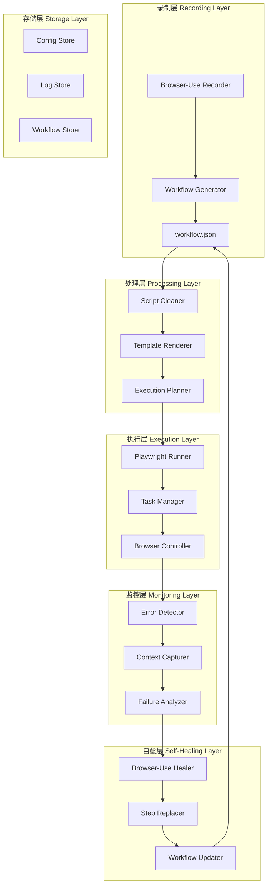

# Browser-AI RPA Starter 开发实践规划

## 📋 项目概述

**项目名称**: Browser-AI RPA Starter  
**项目目标**: 构建一站式自动化RPA解决方案，实现「录制-执行-自愈」三阶段的完整工作流  
**核心价值**: Browser-Use 低代码录制 → Playwright 稳定执行 → Browser-Use 智能自愈

---

## 🎯 需求分析与目标拆解

### 1. 核心功能需求

#### 1.1 录制阶段 (Recording Phase)
- **目标**: 使用Browser-Use/Workflow-Use实现可视化录屏和工作流生成
- **输出**: `*.workflow.json` 文件，支持变量与占位符
- **关键特性**: 
  - 可视化操作录制
  - 自动生成结构化工作流文件
  - 支持变量抽象和占位符替换等脚本编辑操作
  - 失败时自动回退到Browser-Use智能完成

#### 1.2 执行阶段 (Execution Phase)  
- **目标**: 使用Playwright实现高并发、稳定的自动化执行
- **输入**: 渲染后的workflow.json文件
- **关键特性**:
  - 高并发执行能力
  - 本地Chrome Profile复用
  - Jinja2模板渲染支持
  - 智能等待机制
  - 错误捕获与日志记录

#### 1.3 自愈阶段 (Self-Healing Phase)
- **目标**: 使用Browser-Use实现执行失败时的智能修复
- **技术栈**: Browser-Use (与录制阶段一致)
- **关键特性**:
  - 执行失败时自动回退到Browser-Use处理
  - 针对具体失败环节进行局部修复录制
  - 将修复后的新步骤替换原有逻辑
  - 持久化存储修复结果，避免重复异常

### 2. 非功能性需求
- **性能**: 支持高并发执行，单机至少支持10个并发任务
- **稳定性**: 执行成功率 > 95%，自愈成功率 > 80%
- **易用性**: 提供CLI工具和简洁的API接口
- **扩展性**: 支持自定义插件和脚本扩展
- **安全性**: 支持敏感数据加密存储

---

## 🏗️ 技术选型建议

### 3.1 核心技术栈

| 组件 | 技术选择 | 版本要求 | 理由 |
|------|----------|----------|------|
| 录制引擎 | Browser-Use + Workflow-Use | 最新稳定版 | 官方推荐，社区活跃，功能完善 |
| 执行引擎 | Playwright | >=1.40.0 | 跨浏览器支持，性能优异，API丰富 |
| AI自愈 | Browser-Use | 最新稳定版 | 统一技术栈，降低复杂度，保持一致性 |
| 模板引擎 | Jinja2 | >=3.1.0 | Python生态成熟，语法简洁 |
| 配置管理 | YAML + Pydantic | 最新版 | 类型安全，配置验证 |
| 日志系统 | structlog | 最新版 | 结构化日志，便于分析 |
| 数据存储 | SQLite + JSON文件 | - | 轻量级，便于部署 |

### 3.2 开发环境
- **Python版本**: 3.11+ (兼容PyTorch，支持最新语法特性)
- **包管理**: uv (更快的依赖管理)
- **代码格式**: black + isort + ruff
- **测试框架**: pytest + pytest-asyncio
- **文档工具**: mkdocs

---

## 🏛️ 核心架构设计

### 4.1 整体架构图



### 4.2 数据流设计

1. **录制阶段**: User → Browser-Use → workflow.json
2. **处理阶段**: workflow.json + context.yml → Jinja2 → rendered.json
3. **执行阶段**: rendered.json → Playwright → Results/Errors
4. **自愈阶段**: Error + Context → Browser-Use → Fixed Steps → Updated Workflow

---

## 📦 模块/功能划分

### 5.1 目录结构设计

```
browser-use-playwright/
├── docs/                    # 文档目录
│   ├── development-plan.md  # 开发规划（本文档）
│   ├── api-reference.md     # API参考文档
│   └── user-guide.md        # 用户指南
├── src/                     # 源代码目录
│   ├── __init__.py
│   ├── core/           # 核心模块
│   │   ├── recorder.py  # 录制器
│   │   ├── executor.py  # 执行器
│   │   ├── healer.py    # 自愈器
│   │   └── config.py    # 配置管理
│   ├── utils/          # 工具模块
│   │   ├── cleaner.py   # 脚本清理器
│   │   ├── renderer.py  # 模板渲染器
│   │   ├── logger.py    # 日志工具
│   │   └── browser.py   # 浏览器工具
│   ├── models/         # 数据模型
│   │   ├── workflow.py  # 工作流模型
│   │   ├── task.py      # 任务模型
│   │   └── result.py    # 结果模型
│   └── cli/            # 命令行接口
│       ├── main.py      # 主入口
│       ├── record.py    # 录制命令
│       ├── run.py       # 执行命令
│       └── heal.py      # 自愈命令
├── workflows/              # 工作流存储
│   ├── examples/           # 示例工作流
│   └── user/              # 用户工作流
├── contexts/              # 上下文配置
│   ├── dev.yml            # 开发环境
│   ├── prod.yml           # 生产环境
│   └── examples/          # 示例配置
├── tests/                 # 测试目录
│   ├── unit/              # 单元测试
│   ├── integration/       # 集成测试
│   └── e2e/               # 端到端测试
├── scripts/               # 辅助脚本
│   ├── setup.sh           # 环境设置
│   ├── clean.py           # 清理工具
│   └── benchmark.py       # 性能测试
├── chrome-profiles/       # Chrome配置文件
├── logs/                  # 日志目录
├── .venv/                 # 虚拟环境
├── requirements.txt       # 依赖文件
├── pyproject.toml         # 项目配置
├── README.md              # 项目说明
└── LICENSE                # 许可证
```

### 5.2 核心模块设计

#### 5.2.1 Recorder Module (录制模块)
- **职责**: 封装Browser-Use和Workflow-Use的录制功能
- **主要类**: `WorkflowRecorder`, `BrowserUseAdapter`
- **关键方法**: `start_recording()`, `stop_recording()`, `save_workflow()`

#### 5.2.2 Executor Module (执行模块)
- **职责**: 使用Playwright执行工作流
- **主要类**: `PlaywrightExecutor`, `TaskManager`, `BrowserController`
- **关键方法**: `execute_workflow()`, `run_concurrent()`, `handle_error()`

#### 5.2.3 Healer Module (自愈模块)
- **职责**: Browser-Use驱动的错误修复和脚本优化
- **主要类**: `BrowserUseHealer`, `StepReplacer`, `WorkflowUpdater`
- **关键方法**: `analyze_failure()`, `heal_with_browser_use()`, `replace_failed_steps()`, `update_workflow()`

#### 5.2.4 Utils Module (工具模块)
- **职责**: 提供通用工具和辅助功能
- **主要类**: `ScriptCleaner`, `TemplateRenderer`, `Logger`
- **关键方法**: `clean_workflow()`, `render_template()`, `log_structured()`

---

## 🔌 API设计

### 6.1 CLI接口设计

```bash
# 录制工作流
browser-use-playwright record --name "login_workflow" --output ./workflows/

# 执行工作流
browser-use-playwright run --workflow ./workflows/login.json --context ./contexts/prod.yml

# 批量执行
browser-use-playwright batch --workflow-dir ./workflows/ --concurrent 5

# 自愈模式执行
browser-use-playwright run --workflow ./workflows/login.json --auto-heal --ai-provider openai

# 清理和优化工作流
browser-use-playwright clean --workflow ./workflows/login.json --optimize

# 查看执行日志
browser-use-playwright logs --task-id 12345 --follow
```

### 6.2 Python API接口设计

```python
from Browser-use-Playwright_rpa import WorkflowRecorder, PlaywrightExecutor, AIHealer

# 录制工作流
recorder = WorkflowRecorder()
workflow = await recorder.record_workflow(
    name="login_workflow",
    save_path="./workflows/"
)

# 执行工作流
executor = PlaywrightExecutor()
result = await executor.execute_workflow(
    workflow_path="./workflows/login.json",
    context={"username": "test", "password": "secret"},
    concurrent=True
)

# Browser-Use自愈
if not result.success:
    healer = BrowserUseHealer()
    fixed_workflow = await healer.heal_workflow(
        workflow_path="./workflows/login.json",
        failed_step=result.failed_step,
        context=result.context,
        error=result.error
    )
```

### 6.3 配置文件设计

#### 6.3.1 主配置文件 (config.yml)
```yaml
# 基础配置
app:
  name: "browser-use-playwright"
  version: "1.0.0"
  debug: false

# 录制配置
recording:
  browser_use:
    model: "gpt-4o"
    headless: false
    timeout: 30
  output_dir: "./workflows/"
  auto_cleanup: true

# 执行配置
execution:
  playwright:
    browser: "chromium"
    headless: false
    timeout: 30
    user_data_dir: "./chrome-profiles/"
  concurrent_limit: 10
  retry_count: 3

# Browser-Use自愈配置
healing:
  browser_use:
    model: "gpt-4o"
    headless: false
    timeout: 60
  max_attempts: 3
  auto_save: true
  backup_original: true

# 日志配置
logging:
  level: "INFO"
  format: "structured"
  file: "./logs/browser-use-playwright.log"
  rotation: "daily"
```

---

## 🎯 成功标准

### 功能完整性
- ✅ 能够录制复杂的web操作流程
- ✅ 能够稳定执行录制的工作流
- ✅ 能够在执行失败时自动修复
- ✅ 支持模板变量和上下文管理
- ✅ 提供友好的CLI界面

### 性能指标
- ✅ 单个工作流执行成功率 > 95%
- ✅ AI自愈成功率 > 80%
- ✅ 支持10个并发任务
- ✅ 平均响应时间 < 5秒

### 代码质量
- ✅ 单元测试覆盖率 > 85%
- ✅ 代码符合PEP8规范
- ✅ 文档完整度 > 90%
- ✅ 无严重安全漏洞

---

## 📝 设计决策记录

### DDR-001: 技术栈选择
**决策**: 选择Browser-Use + Playwright的组合，自愈阶段也使用Browser-Use  
**理由**: Browser-Use提供最佳的录制体验，Playwright执行稳定可靠，统一使用Browser-Use进行自愈降低复杂度并保持技术栈一致性  
**日期**: 2024-12-29

### DDR-004: 自愈策略优化
**决策**: 将自愈阶段从Computer-Use API改为Browser-Use直接处理  
**理由**: 简化技术栈，降低外部依赖，提高响应速度，保持录制和自愈逻辑的一致性  
**日期**: 2024-12-29

### DDR-002: 项目结构设计  
**决策**: 采用模块化设计，分离录制、执行、自愈三大核心功能  
**理由**: 便于开发、测试和维护，支持独立升级各个模块  
**日期**: 2024-12-29

### DDR-003: 配置管理方案
**决策**: 使用YAML配置文件 + Pydantic验证  
**理由**: YAML可读性好，Pydantic提供类型安全和验证  
**日期**: 2024-12-29

---

## 🔄 变更日志

### v1.0.0-plan (2024-12-29)
- 初始开发规划文档创建
- 完成需求分析和技术选型
- 制定详细的开发计划和时间线

---

**文档状态**: 🟢 当前版本  
**最后更新**: 2025-06-18  
**下次审查**: 开发过程中持续更新 